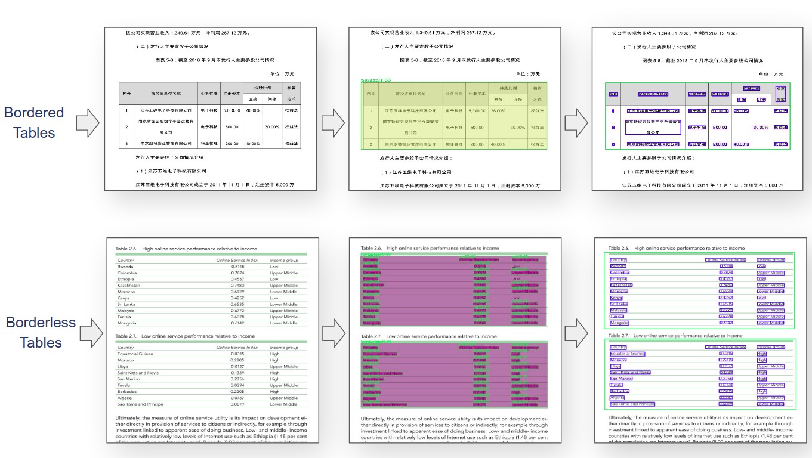
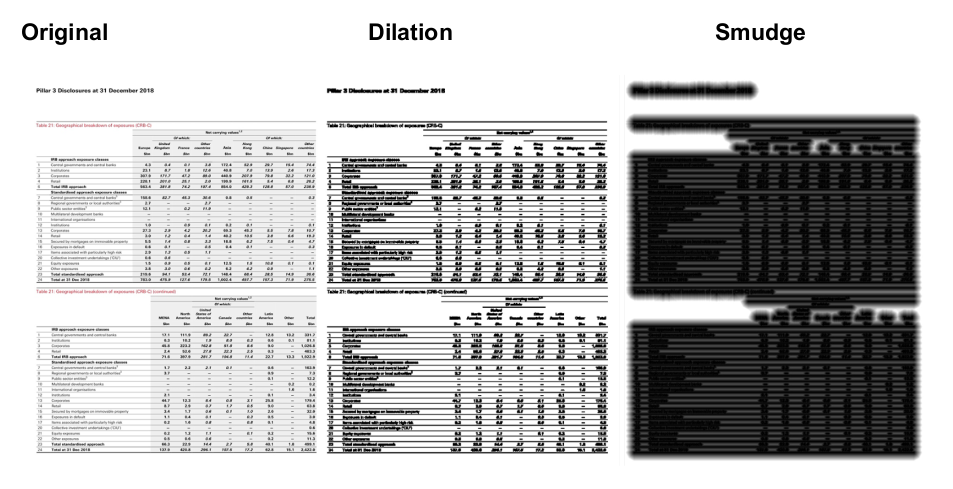

## 1. Introduction
It is an automatic table recognition method for interpretation of tabular data in document images. I present an improved deep learning-based end to end approach for solving both problems of table detection and structure recognition using a single Convolution Neural Network (CNN) model. It is a Cascade mask Region-based CNN High-Resolution Network (Cascade mask R-CNN HRNet) based model that detects the regions of tables and recognizes the structural body cells from the detected tables at the same time.



## 2. Setup
<b>Models are developed in Pytorch based <a href="https://github.com/open-mmlab/mmdetection">MMdetection</a> framework (Version 1.2)</b>
<br>

<pre>
pip install -q mmcv terminaltables
git clone --branch v1.2.0 'https://github.com/open-mmlab/mmdetection.git'
cd "mmdetection"
pip install -r "/content/mmdetection/requirements/optional.txt"
python setup.py install
python setup.py develop
pip install -r {"requirements.txt"}
pip install pillow==6.2.1 
pip install mmcv==0.4.3
</pre>

<b>Code is developed under following library dependencies</b> <br>

PyTorch = 1.4.0<br>
Torchvision = 0.5.0<br>
Cuda = 10.0<br>

<pre>
pip install torch==1.4.0+cu100 torchvision==0.5.0+cu100 -f https://download.pytorch.org/whl/torch_stable.html
</pre>

**If you are using Google Colaboratory (Colab), Then you need add**
```
from google.colab.patches import cv2_imshow
```
and replace all the `cv2.imshow` with `cv2_imshow`

## 3. Model Architecture


## 4. Image Augmentation
<br>


## 5. Training
You may refer this <a href="https://www.dlology.com/blog/how-to-train-an-object-detection-model-with-mmdetection/">tutorial</a> for training Mmdetection models on your custom datasets in colab.<br>

You may refer this <a href="https://github.com/kshitijsoni/GSoC-2022--Extraction-of-data-from-tables-in-Scientific-papers/blob/main/TSR/Data%20Preparation/generateVOC2JSON.py">script</a> to convert your Pascal VOC XML annotation files to a single COCO Json file.


## Acknowledgements

This project would not have been possible without their support. <br>
Magdalena Zarowiecki<br>
Andres Becerra<br>

1. The **MMdetection** project team for creating the amazing framework to push the state of the art computer vision
research and which enabled us to experiment and build state of the art models very easily.

2. **Google Colaboratory** team for providing free high end GPU resources for research and development. All of the code base was developed using Google colab and couldn't be possible without it.


